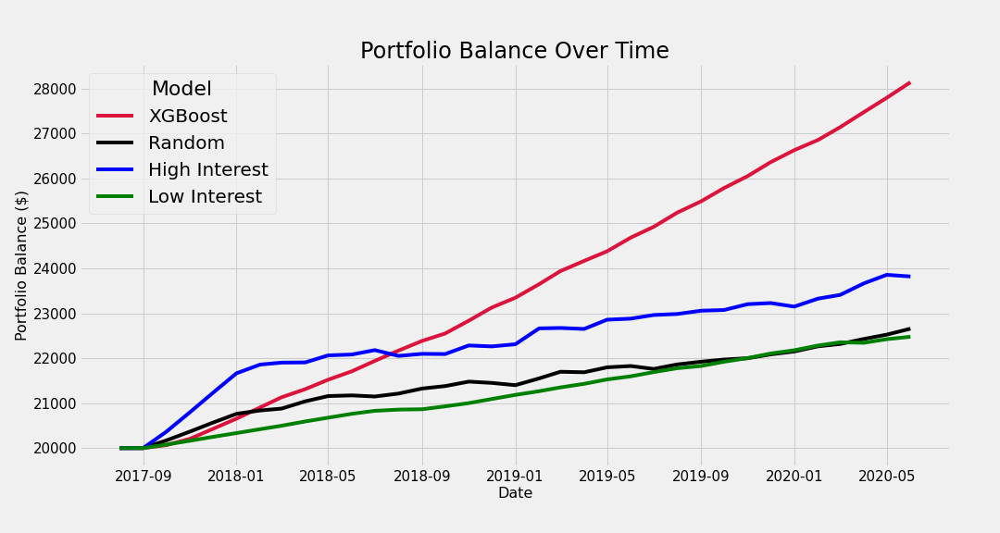
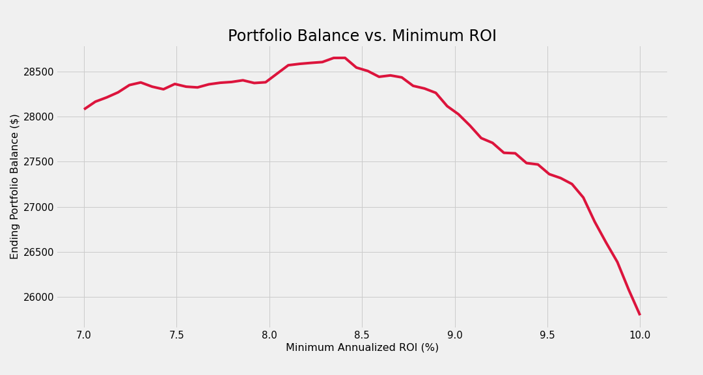

# Social Capital
### Predicting the Return on Investment (ROI) of Crowd-Funded Loans

The stock market has it's purpose, but wouldn't you enjoy investing your money in real people? That is the goal of crowd-funded loans issued by [LendingClub](https://www.lendingclub.com/). Here's how it works:

Bob comes to Lending Club with $20,000 in credit card debt. He's paying an interest rate of 40% on this debt. However, Lending Club's non-traditional credit model decides Bob can be loaned money at 15% instead. Lending Club offers Bob a $20,000 loan to pay off his credit card debt. However, this loan is not funded by the company itself. This loan will be crowd-funded by investors.

Investors on the Lending Club platform can "invest" to fund Bob's loan. You invest by funding a portion of the loan, and then you receive payments as Bob pays off the loan. However, if Bob defaults on his loan you can lose out on your money.

This scenario is a win for both Bob and the investors. Bob gets to pay off his debt at a lower interest rate, saving thousands in interest payments and penalties. Investors win by earning a (hopefully) significant return on their investments and are able to diversify their portfolios by adding a new asset class, consumer loans.

Investors don't want to lose money though, so can we train a machine learning algorithm to predict the return on investment of a LendingClub loan?

## Explanatory Notebooks

Below, you'll find several notebooks and README sections walking you through the project.

1. [Data Cleaning](Coming Soon, please review the data-cleaning.py file)
2. [Exploratory Data Analysis](Coming Soon)
3. [Calculating ROI](Coming Soon)
4. [Model Training](Modeling.ipynb)
5. [Portfolio Simulation](Simulation.ipynb)
6. [SHAP Analysis](Coming Soon)
7. [Future Work](#future-work)
8. [Data Sources](#data-sources)

## Future Work

So far I've only trained the following models:

* XGBoost
* Random Choice
* Select High Interest Loans
* Select Low Interest Loans

XGBoost is the only machine learning algorithm out of those. Next steps are to add more machine learning models. Primarily:

* Decision Tree
* Random Forest
* Gradient Boosted Trees

Additionally, I will be performing hyperparameter tuning and k-fold cross validation while continuing to evaluate models with the portfolio simulator. Once I have settled on a "winning" model I will be performing [SHAP analysis](https://github.com/slundberg/shap) on that model to better understand it's output. I do have an old [SHAP notebook](SHAP.ipynb) if you'd like an advanced preview.

I will also be completing notebooks explaining the steps involved in data cleaning, exploratory data analysis, and calculating return on investment. In addition, I will be using the portfolio simulator to analyze what portfolio starting balances, minimium ROI, and amount to invest per loan offer the best returns for our model over the testing dataset. 

## Data Sources

The data is provided free of charge by LendingClub. Please see their [Historical Loan Issuance Data](https://www.lendingclub.com/statistics/additional-statistics) page to download data on loans that have been issued. As of now this project uses all loan issuance files up to 2020-Q2. I also used loan payment data to calculate return on investment of completed loans. Please see [Payments Made to Investors](https://www.lendingclub.com/statistics/additional-statistics?) to acquire those files. 
